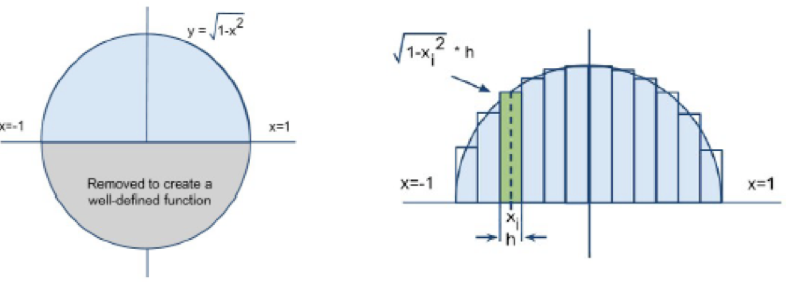
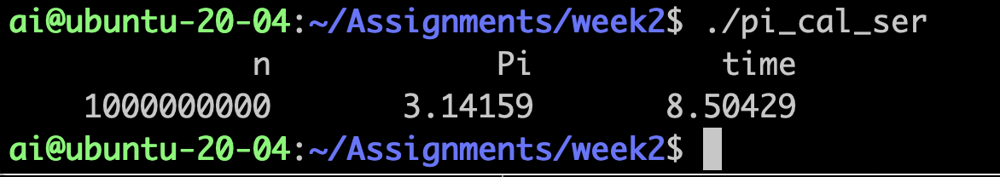

## Homework Assignment
week2 hw1

## Score
100

## Due
Wed, Jul-14-2021, 11:59 PM

## Problem
Calculate Pi using numeric integration methods. Parallelize it using OpenMP and analyze the performance as below.

Q1. The pseudocode shown below is the calculation of pi by the method of numeric integration as Figure 1. Complete the serial code. There are many ways to calculate the pi value. Your code should follow the pseudocode.



```
sum = 0;
h = 2.0 / n;
for (i=0; i<n; i++)
{
    x = -1 + (i+0.5)*h;
    sum += sqrt(1 - x*x)*h;
}
pi = sum*2.0;
```
- Set the number of rectangles to 1,000,000,000.  
- Use a time function to measure elapsed time.  
- Generate output as below and put it in the analysis text format.  




Q2. Parallelize it using the "reduction" clause and test it with P=2, 4, 8, 16. Run it on the class VM and report the results as below.

```
ai@ubuntu-20-04:~/Assignments/week2$ ./pi_cal_par
             n       threads            Pi          time
    1000000000             2       3.14159       1.95495
             n       threads            Pi          time
    1000000000             4       3.14159         1.035
             n       threads            Pi          time
    1000000000             8       3.14159      0.896142
             n       threads            Pi          time
    1000000000            16       3.14159      0.574471
```

- To measure OpenMP wall-clock time, use omp_get_wtime().
- The calculated PI should be very similar to PI value (3.14159...)

Q3. Change the “reduction” clause to use the "atomic" directive. Then, test it with P=1, 2, 4, 6, 8. Report the results as previously. Provide your comments on why atomic is a bad idea for this case.

Q4. Make a speed-up plot (using R or MATLAB) to represent three cases: ideal, using reduction, and using atomic cases. Please use R or MATLAB to make a plot.

### Submit
- Submit a zip file including source codes and document (PDF) by email to taehyuk.ahn@gist.ac.kr
- Filename should be "HPC_week2_hw1_YourLastname_YourFirstName.gz"
- Email title should be "HPC week2 hw1 submission"
