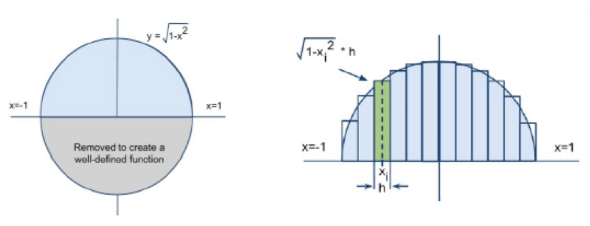

## Homework Assignment
week2 hw1

## Score
100

## Due
Wed, Jul-14-2021, 11:59 PM

## Problem
Calculate Pi using numeric integration methods. Parallelize it using OpenMP and analyze the performance as below. Prepare a document (.txt or .pdf) to analyze results and submit it with your source codes.

Q1. The pseudocode shown below is the calculation of pi by the method of numeric integration as Figure 1. Complete the serial code. There are many ways to calculate the pi value. Your code should follow the pseudocode.

`
sum = 0;
h = 2.0 / n;
for (i=0; i<n; i++) 
{
    x = -1 + (i+0.5)*h;
    sum += sqrt(1 - x*x)*h;
}
pi = sum*2.0;
`
- Set the number of rectangles to 1,000,000,000.  
- Use a time function to measure elapsed time.  
- Generate output as below and put it in the analysis text format.  

